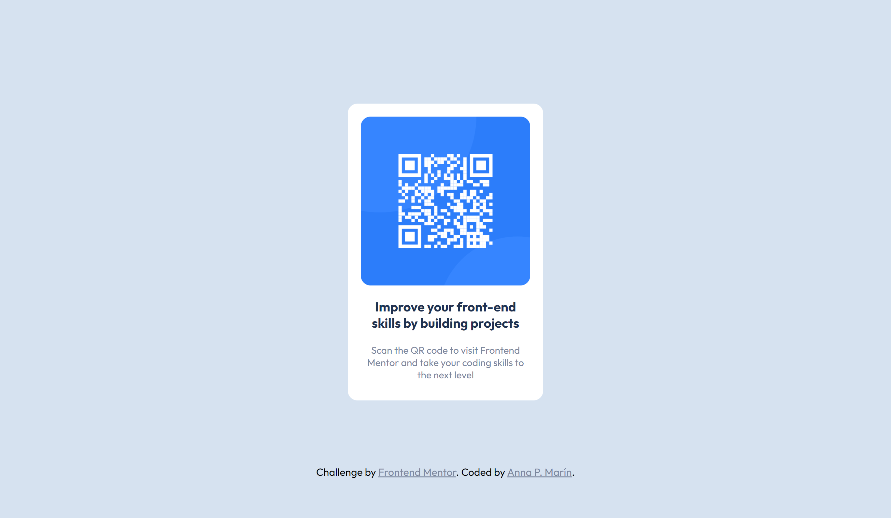

# Frontend Mentor - QR code component

This is a challenge inspired by Frontend Mentor. 
Frontend Mentor challenges help us improving our coding skills by building realistic projects. 

## Table of contents

- [Overview](#overview)
  - [Screenshot](#screenshot)
  - [Links](#links)
- [My process](#my-process)
  - [Built with](#built-with)
  - [What I learned](#what-i-learned)
  - [Continued development](#continued-development)
- [Author](#author)

## Overview

### Screenshot

### Links

- [Solution URL](https://www.frontendmentor.io/challenges/qr-code-component-iux_sIO_H)
- [Live Site URL: 

## My process

### Built with 

- Semantic HTML5 markup
- CSS custom properties
- Flexbox

### What I learned
It has not been a great challenge since I had previous knowledge in html and css but it has served to reinforce them and carry out the exercise with agility.

### Continued development
My next goals would be continue improving my REACT and JS knowledge.

## Author

- Portfolio - [anna p. marin](https://annapmarin.github.io/newportfolio/)
- Frontend Mentor - [@annapmarin](https://www.frontendmentor.io/profile/annapmarin)